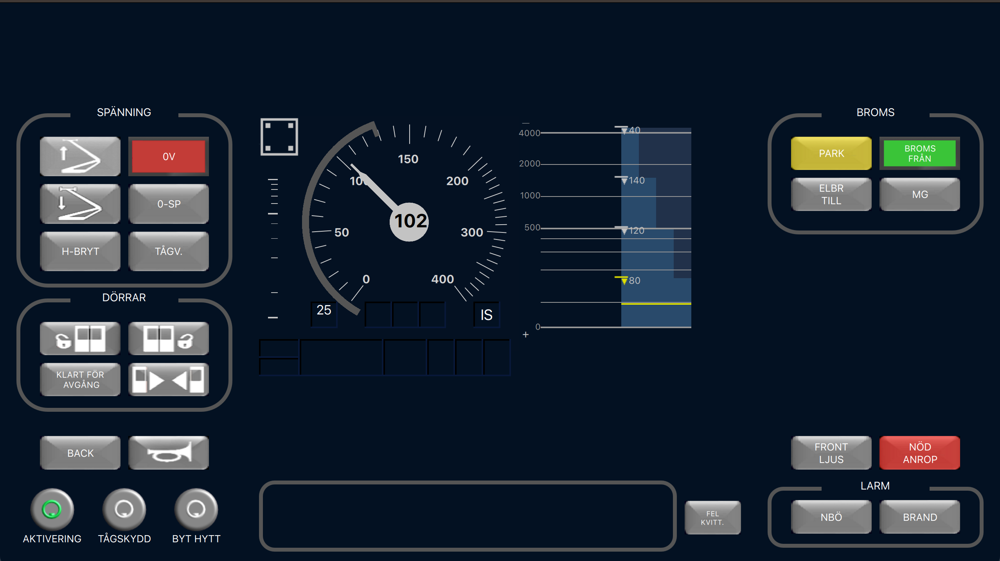

# Driver Machine Interface

A project in which a standalone Driver Machine Interface (DMI) is developed. The DMI is designed to be used togheter with a simulator made by VTI, The Swedish National Road and Transport Research Institute.

## Information about QT

The DMI is implemented in QT, version 6.4. 

### How to start the application

To start the application, do the following steps:

- Build / run the *test_module* application.
- Wait until the test_module has started (indicated by the debug message **server started**). 
- Build / run the *train_dmi* application. 

## Known bugs
- The speedometer doesn't scale with the window and remains 

## Improvements
- The Circular Speed Gauge is drawn with the QML object called "Path Angle Arc". This object draws a circle arc from a start angle and to a end angle. However this object also has a stoke width value that is used to specify the width of the arc. This causes the circle arc to be drawn to far. We believe that the amount the arc is drawn to far with is the angle that corresponds to half the stroke width.
- The gradient profile consists of four "rectangles", a improvement would be that this amount is dynamically determined during runtime. 
- There is currently a delay (around 10ms) when sending data. This is needed so not to interrupt the functions that handle the received data. This is probably not a optimal solution.

## Architecture

### Graphics
The application is built around three main views ATC, ETCS and DESK which are all represented as separate folders/files in the project.
 
The ATC view is currently not implemented.
 
The ETCS view is implemented in accordance with the [EU standard](ERA_ERTMS_015560_v360.pdf). This view is divided into multiple files, each representing an internal area. There are some areas that consist of multiple files, such as the speedometer.
 
The Desk view is implemented according to requirements specified by VTI. This view is split into several button groups, each representing a cluster of buttons which belong to the same functionality.
 
### Backend
The backend consists of several CPP files. The file/class called DMI_HANDLER contains the logic responsible for running and updating the GUI. In this class there is a timer that fires every .5 seconds which is used to handle the animations in the program.
 
There is also a network client file/class which is responsible for connecting to a server (test module), currently at address 127.0.0.1:1200.
 
There is also a button handler file/class which has all the button functions. Where each button in the QML code sends a signal which triggers its function in the CPP code. The button function then triggers an update to be sent to the server with information about what button was pressed.
 
There is also a file/class called speedometer. This class is responsible for updating all values of the speedometer.
 
There is also a header file called **network_interface.h** that specifies all naming constants. There are two namespaces one called VTI_DMI, which contains all naming constants for signals, JSON templates etc. The second namespace is called STATE and specifies all states that buttons can be in.

## Licence

Resultatet som genererats av studenten inom ramen för projektet ska ägas av *VTI*, statens väg- och transportforskningsinstitut som kan ta det i drift och vidareutveckla det. Studenten bibehåller rätten att stå som upphovsman och visa upp de ursprungliga resultaten, t ex i CV och portfolio.

### Authors

Filip Kjellgren

Viktor Lindell

Linus Olsson

Pontus Kågström

Erik Delbom

Linus Bergman

Mikael Johnsson
